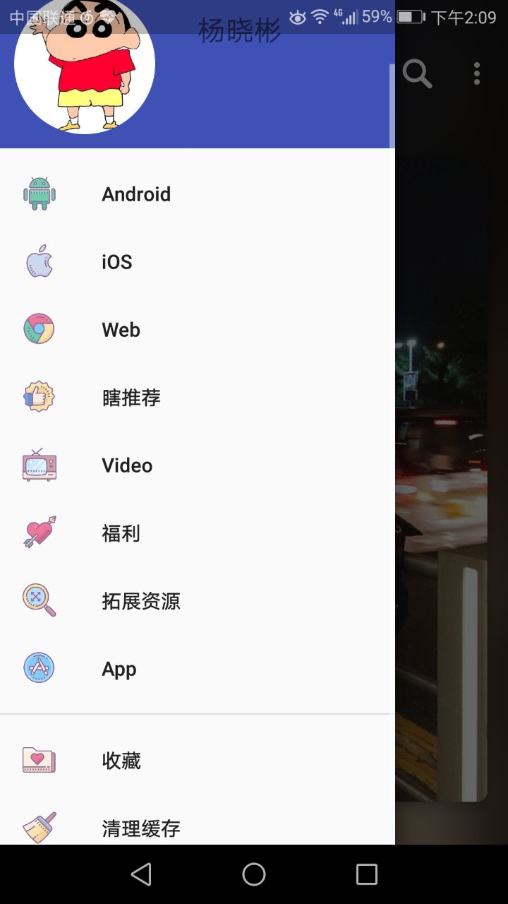

### [GankIO](http://gank.io/) Android 客户端 感谢 代码家 提供Api支持！

### App
MVP+Dagger2.android+Retrofit+RxJava2+Glide+Realm。
单Activity+多Fragment 架构,fragment back 处理。

### ScreenShot

### [APK下载](apk/app-debug.apk)

[pgy下载页](https://www.pgyer.com/bgWq)

### 功能
1. GitHub 账户即可登录，无需密码，用户创建本地账户收藏干货用。
2. 侧滑收藏／取消收藏。
3. 每日干货浏览，分类浏览。
4. 搜索功能，搜索历史支持。
5. 高清妹子长按下载。
6. 干货分享（原生）。
7. 无网络缓存（okHttpClient）。
8. 缓存清理。
9. Item 图片预览图，点击查看大图。

### 开源库
1. [RxJava2](https://github.com/ReactiveX/RxJava)
2. [Dagger2.android](https://github.com/google/dagger)
3. [ButterKnife](https://github.com/JakeWharton/butterknife)
4. [Glide](https://github.com/bumptech/glide)
5. [PhotoView](https://github.com/chrisbanes/PhotoView)
6. [rxPermission](https://github.com/tbruyelle/RxPermissions)
7. [Retrofit](https://github.com/square/retrofit)
8. [Realm](https://github.com/realm/realm-java)
9. [Easy RecyclerView](https://github.com/yangxiaobinhaoshuai/EasyRecyclerView)
10. [BaseKits](https://github.com/yangxiaobinhaoshuai/Android-BaseKits)

### 欢迎Issue！

